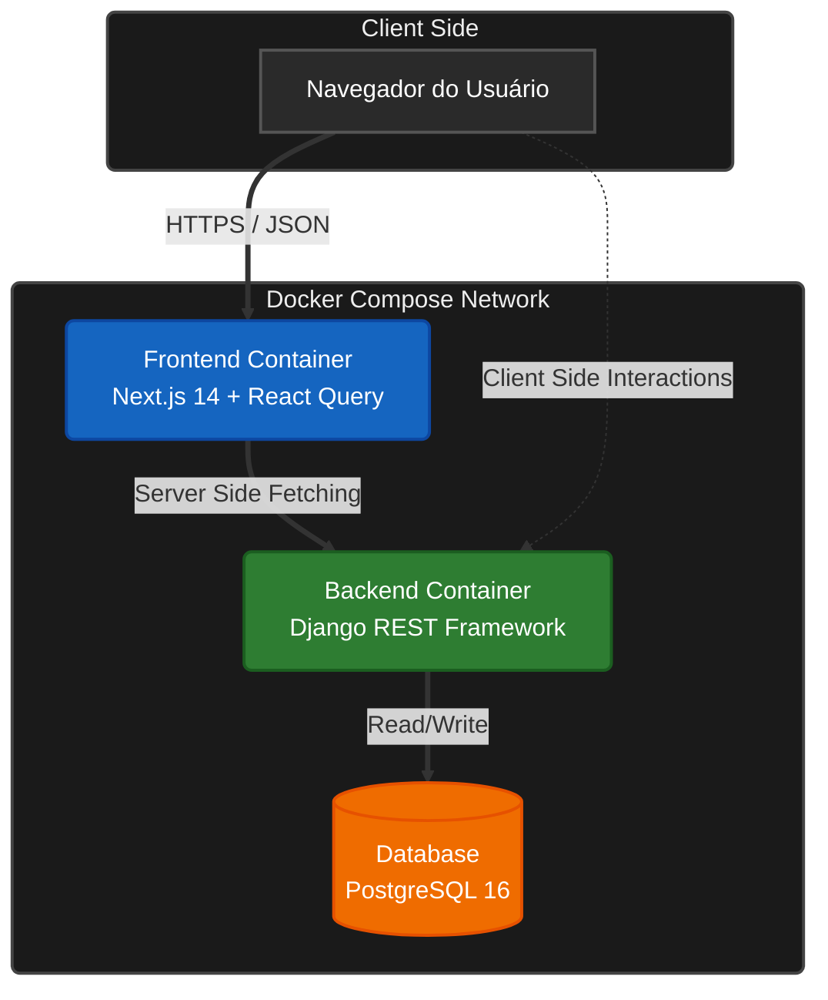

# Arquitetura: Loc10 (Showcase Técnico)

## 1. Fluxo de Dados (High-Level)

## 2. Design de Componentes

### 2.1 Backend (Django 5)
**Papel:** Fonte da Verdade (Source of Truth), Regras de Negócio e Persistência.

*   **Integridade:** Uso mandatório de Transações Atômicas (`transaction.atomic()`) para garantir consistência ACID em operações financeiras e de estoque.
*   **Segurança:** Gestão de variáveis de ambiente via `python-decouple`.

### 2.2 Frontend (Next.js 14)
**Papel:** Apresentação e UX Otimista.

*   **Padrão:** Client-Side Fetching com Service Layer Pattern.
    *   Componentes visuais não tocam `fetch` ou `axios` diretamente.
    *   Lógica isolada em `src/services`.
*   **Estado:** TanStack Query (v5) gerencia Cache, Deduplicação e Atualizações Otimistas (Optimistic Updates).

## 3. Decisões Arquiteturais (Por Quê?)

### Por que React Query?
Para este domínio (Gestão de Ativos), 90% do estado da aplicação é Estado do Servidor (Disponibilidade, Histórico). Usar Redux seria verboso e desnecessário. O React Query sincroniza, invalida cache e gerencia "loading states" automaticamente.

### Por que Docker?
Mitigação do risco "Funciona na minha máquina". O ambiente é reprodutível com um único comando `docker compose up`, garantindo paridade entre desenvolvimento e produção.