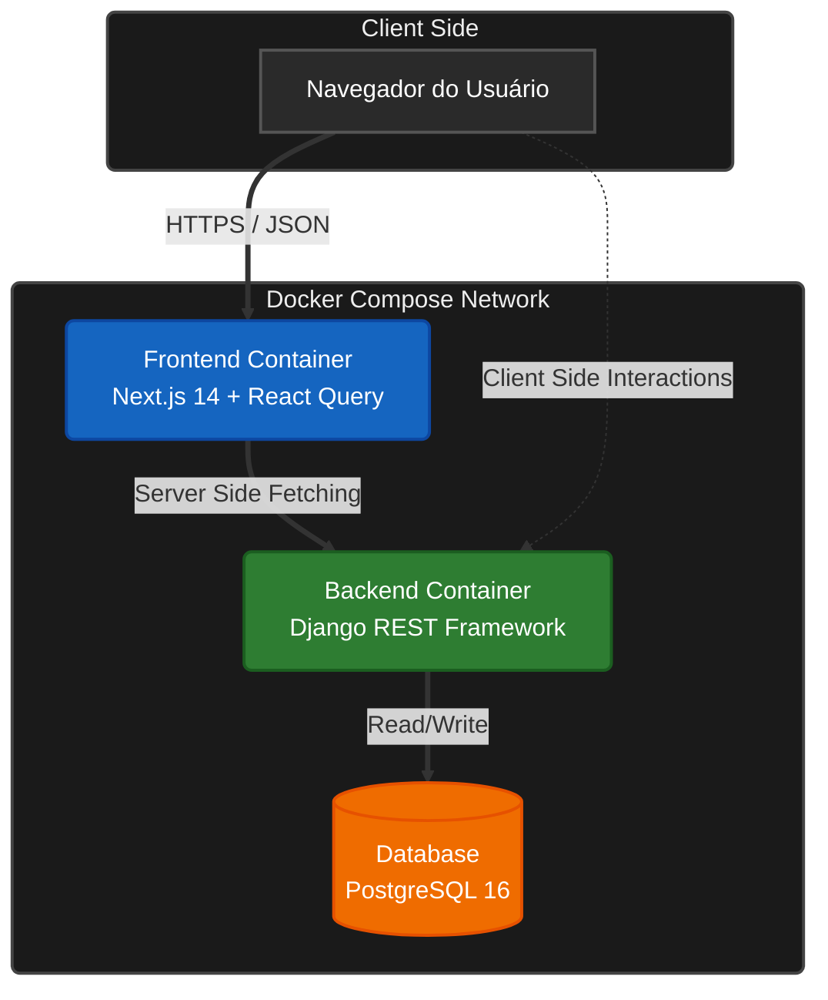
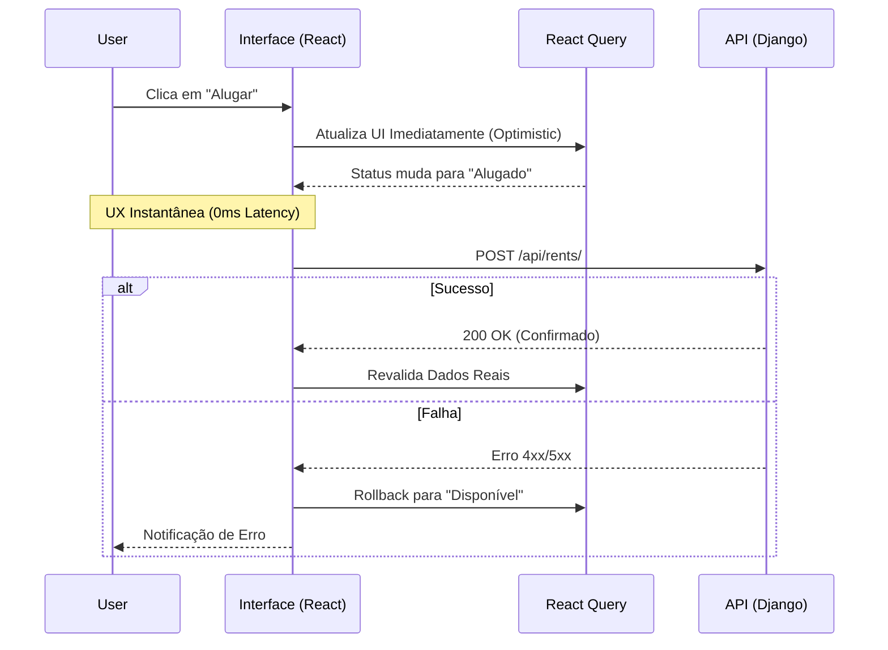

# 🚜 Sigma Loc10 | Enterprise Asset Management

> **Technical Showcase:** Aplicação Full Stack desenvolvida com foco em **Arquitetura Resiliente**, **Escalabilidade** e **Experiência do Usuário (UX)**.

<div align="center">


</div>

---

## 🎯 Contexto & Produtividade

Este projeto é um *Proof of Concept (PoC)* desenvolvido em **menos de 16 horas corridas**.

O objetivo foi simular um cenário de pressão real para demonstrar como a união de **Experiência Sênior** (20 anos de mercado) com **Fluxos de IA Modernos** permite entregar software enterprise, testado e documentado, em tempo recorde. Não é apenas sobre codificar rápido, mas sobre arquitetar corretamente desde o primeiro minuto.

## 💎 Filosofia de Engenharia: Ética e Performance

Minha abordagem no desenvolvimento é guiada por dois pilares inegociáveis, nascidos da minha experiência como Analista de Risco e como usuário exigente:

### 1. UX-Driven (Obsessão pela Experiência)
Software lento ou confuso é um desrespeito ao tempo do usuário.
* **Tolerância Zero à Latência:** Implementei **Optimistic UI** porque o usuário não deve esperar o servidor "pensar" para ver o resultado de sua ação.
* **Resiliência Visual:** O sistema deve parecer robusto. Tratamento de erros, *loading states* e feedbacks visuais não são "extras", são requisitos éticos de entrega.

### 2. Risk-Driven (Engenharia Orientada a Risco)
Segurança e consistência de dados protegem a saúde do negócio.
* **🛡️ Integridade de Estoque:** Prevenção total de "Overbooking" através de transações atômicas (ACID) no Backend.
* **📉 Dívida Técnica Controlada:** Adoção de **Service Pattern** no Frontend. A UI desconhece a lógica HTTP, facilitando refatorações futuras sem quebrar a tela do usuário.

---

## 🏗️ Arquitetura do Sistema

A solução foi orquestrada via Docker Compose para garantir paridade entre desenvolvimento e produção.



### UX na Prática (Optimistic UI)
O diagrama abaixo detalha o fluxo que implementei para eliminar a sensação de espera durante o aluguel:



## 🛠️ Stack Tecnológico

### Frontend | Next.js 14 + React Query
A escolha do stack foi pragmática, focada em resolver dores reais de performance:

- **TanStack Query (v5):** Elimina a necessidade de useEffect manuais e garante cache inteligente.
- **Service Layer Desacoplada:** Isolamento total da lógica de API em `src/services`, garantindo tipos estritos (TypeScript).
- **Design System:** TailwindCSS + Lucide Icons para interface limpa, acessível e consistente.

### Backend | Django REST Framework
Escolhido pela segurança padrão ("batteries-included") e velocidade de implementação:

- **Arquitetura Modular:** Separação clara de contextos (`core`, `accounts`, `equipment`) facilitando futura extração para microsserviços.
- **Django Admin:** Utilizado como Backoffice administrativo, economizando centenas de horas de desenvolvimento.
- **Serializers:** Validação estrita de entrada (Sanitization) para garantir que nenhum dado sujo entre no banco.

## 🚀 Instalação e Execução (Zero-Config)
O ambiente é 100% Dockerizado para garantir reprodutibilidade.

### 1. Clone e Suba (Zero-Touch)

```bash
git clone https://github.com/SEU_USUARIO/sigma-loc10.git
cd sigma-loc10

# Sobe todo o ecossistema
# O script de entrypoint fará automaticamente:
# 1. Aguardar o Banco
# 2. Rodar Migrations
# 3. Carregar dados de teste (Seed)
# 4. Criar superusuário (admin/admin123)
cp .env.example .env
docker compose up --build
```

Aguarde até ver a mensagem **"Ready in Xms"** no terminal.
O sistema estará disponível em:
- **Frontend:** http://localhost:3000
- **Admin/Backoffice:** http://localhost:8000/admin (Login: `admin` / Senha: `admin123`)

## 🧪 Qualidade e CI/CD
Qualidade não é opcional. O projeto conta com pipeline no GitHub Actions validando cada commit:

- **Frontend Check:** Linting (ESLint) e verificação de Build.
- **Backend Check:** Testes de integração (Pytest) rodando contra banco PostgreSQL efêmero.

Para rodar localmente:

```bash
# Testes do Backend
docker compose exec api pytest

# Lint do Frontend
docker compose exec web npm run lint
```

---

## 📚 Documentação Estendida (Deep Dive)

Para não poluir o README principal, detalhei as decisões de engenharia na pasta [`.docs/`](./.docs). Recomendo a leitura para entender a profundidade do projeto:

| Arquivo | Descrição |
| :--- | :--- |
| [**00_contexto_produto.md**](./.docs/00_contexto_produto.md) | 🧠 **Visão de Negócio:** O problema real que o software resolve e a filosofia *Risk-Driven*. |
| [**01_stack_regras.md**](./.docs/01_stack_regras.md) | 👮 **Linter Humano:** Regras estritas de código, *Anti-patterns* proibidos e guia de estilo para IA. |
| [**02_arquitetura.md**](./.docs/02_arquitetura.md) | 📐 **Diagramas:** Detalhamento do fluxo de dados, camadas de serviço e decisões de *Clean Arch*. |
| [**03_matriz_risco.md**](./.docs/03_matriz_risco.md) | 🛡️ **Análise de Risco:** Tabela completa de riscos de negócio (Overbooking, Latência) e suas mitigações técnicas. |

## 🗺️ Roadmap (V2.0)
Melhorias mapeadas para a próxima sprint:

- [ ] **Segurança:** Implementar autenticação via JWT com rotação de chaves.
- [ ] **Concorrência:** Adicionar `select_for_update` no Postgres para travar linhas em cenários de alta concorrência.
- [ ] **Infra:** Deploy automatizado na Vercel (Front) e Railway (Back).

---
*Desenvolvido por Paulo Marques*