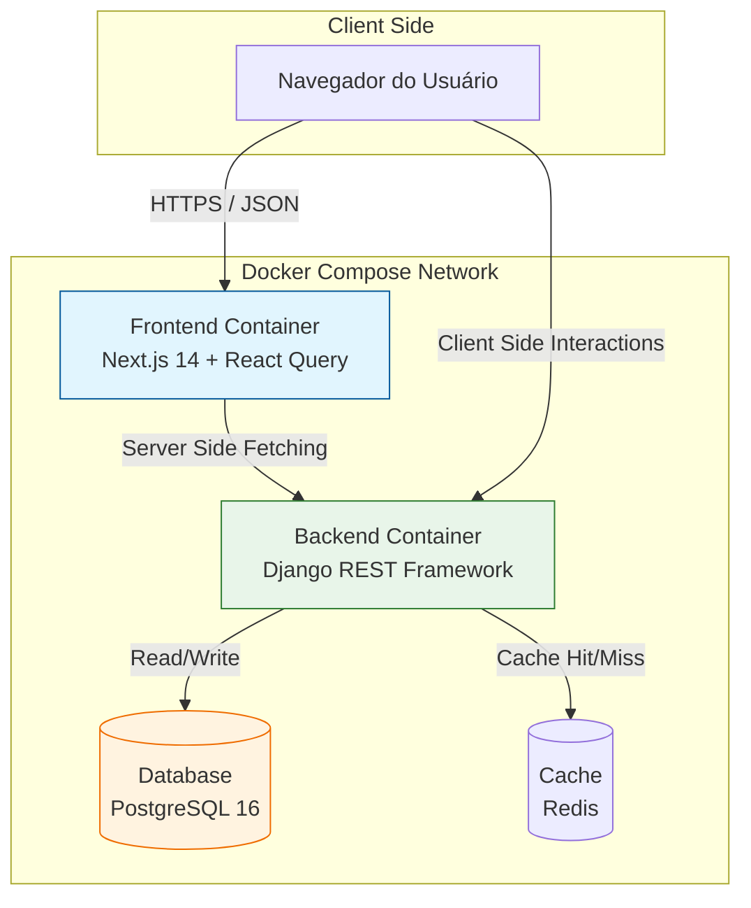
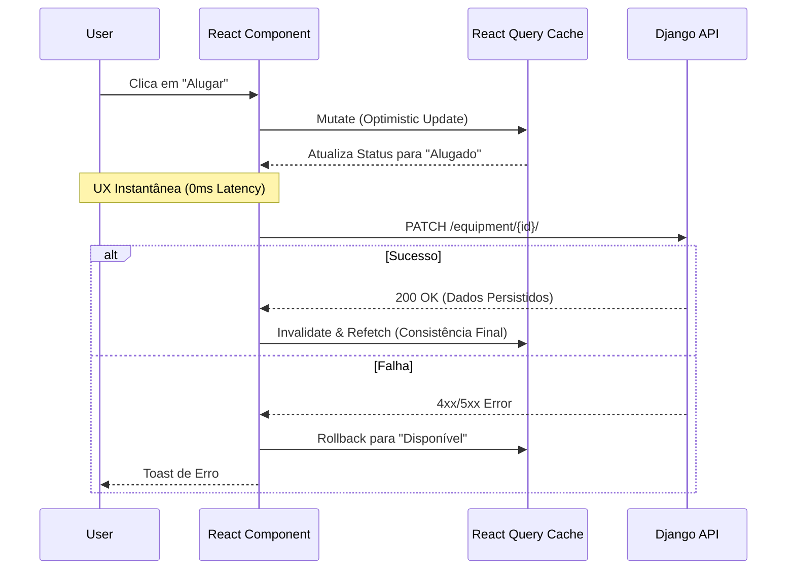

# 🚜 Sigma Loc | Enterprise Asset Management

> **Technical Showcase**: Aplicação Full Stack desenvolvida com foco em **Arquitetura Resiliente**, **Escalabilidade** e **Mitigação de Riscos**.

<div align="center">


</div>

## 🎥 Showcase & Demo

*(Insira aqui o GIF/Vídeo demonstrando o fluxo: Dashboard -> Detalhe -> Aluguel -> Atualização Otimista)*

> **Contexto:** Este projeto foi desenvolvido em 48h como um *Proof of Concept (PoC)* para demonstrar competências de Engenharia de Software Sênior, focando na integração robusta entre um Frontend moderno e um Backend Enterprise.

## 🧠 Engenharia Orientada a Risco (Risk-Driven Engineering)

Como Analista de Risco e Engenheiro Sênior, projetei o sistema antecipando falhas críticas de negócio:

* **🛡️ Integridade de Estoque:** Prevenção de "Overbooking" (aluguel duplo) através de modelagem estrita no banco de dados e transações atômicas no Backend.
* **📉 Dívida Técnica Controlada:** Adoção de **Service Pattern** no Frontend para blindar a UI de mudanças na API. Se o Backend mudar amanhã, refatoramos apenas a camada de serviço, não os componentes visuais.
* **⚡ Alta Disponibilidade:** Frontend construído com *Next.js Standalone Build* em container otimizado e desacoplado da API. O catálogo permanece visível (leitura) mesmo se o serviço de transação oscilar.

---

## 🏗️ Arquitetura do Sistema

O diagrama abaixo ilustra a orquestração via Docker Compose e o fluxo de dados entre os serviços.



### Fluxo de Otimização (Optimistic UI)
Demonstração visual de como o React Query melhora a UX durante o aluguel, atualizando a tela antes mesmo da resposta do servidor.



## 🛠️ Stack Tecnológico

### Frontend (Client-Side) | Next.js 14 + React Query
A escolha do stack não foi baseada em "hype", mas em resolução de problemas:

- **TanStack Query (v5):** Em vez de reinventar a roda com useEffect e gerenciamento manual de loading/error states, utilizei React Query para Server State Management.
  > **Ganho:** Cache automático, deduplicação de requests e Optimistic Updates.

- **Service Layer Desacoplada:** Toda a lógica de comunicação HTTP reside em `src/services`, retornando tipos estritos (TypeScript Interfaces).

- **Design System:** TailwindCSS + Lucide Icons para rápida iteração visual sem perder a consistência de um design system enterprise.

### Backend (Server-Side) | Django REST Framework
Escolhido pela segurança padrão ("batteries-included") e velocidade de desenvolvimento:

- **Arquitetura Modular:** Divisão clara de contextos (`core`, `accounts`, `equipment`) facilitando a manutenção futura ou migração para microsserviços.

- **Django Admin Customizado:** Utilização do painel nativo para operações de Backoffice, economizando centenas de horas de desenvolvimento de interfaces CRUD internas.

- **Serializers Robustos:** Validação de dados na entrada (Input sanitization) antes de tocar o banco de dados.

## 📂 Estrutura do Projeto
A organização reflete padrões de Clean Architecture:

```text
sigma-loc10/
├── apps/
│   ├── api/                 # Django (Backend)
│   │   ├── equipment/       # Domain: Gestão de Ativos
│   │   ├── core/            # Configs e Utils
│   │   └── fixtures/        # Dados iniciais (Seed)
│   └── web/                 # Next.js (Frontend)
│       ├── src/
│       │   ├── app/         # App Router (Pages)
│       │   ├── components/  # Atomic Components (Modals, Cards)
│       │   ├── services/    # API Layer (Axios/Fetch Wrappers)
│       │   └── providers/   # Contexts (React Query, Toast)
├── docker-compose.yml       # Orquestração
└── README.md
```

## 🚀 Instalação e Execução (Zero-Config)
Utilizamos Docker para garantir que o ambiente seja reprodutível em qualquer OS (Windows/Linux/Mac).

### 1. Clone e Suba

```bash
git clone https://github.com/SEU_USUARIO/sigma-loc10.git
cd sigma-loc10

# Sobe Backend, Frontend, Redis e Postgres
docker compose up -d --build
```
Aguarde o build finalizar. O Frontend estará disponível em `http://localhost:3000`.

### 2. Popule o Banco de Dados (Data Seeding)
Para visualizar o dashboard preenchido, execute o script de carga de dados:

```bash
docker compose exec api python manage.py loaddata initial_data.json
```

### 3. Acessos
- **Aplicação:** `http://localhost:3000`
- **API Docs:** `http://localhost:8000/api/`
- **Admin Panel:** `http://localhost:8000/admin`

Para acessar o admin, crie um superusuário:
```bash
docker compose exec api python manage.py createsuperuser
```

## 🧪 Qualidade e Testes
Pipeline de CI configurado via GitHub Actions para garantir integridade.

**Frontend:** Testes unitários focados em regras de negócio (ex: cálculo de diárias) usando Jest.

```bash
docker compose exec frontend npm test
```

**Backend:** Testes de integração planejados com PyTest.

## 🗺️ Roadmap Técnico
O que eu faria com mais tempo (V2.0):

- [ ] **Autenticação Segura:** Implementar NextAuth.js com JWT e Refresh Tokens (HttpOnly Cookies).
- [ ] **Concorrência Real:** Implementar `select_for_update` no Postgres para evitar condições de corrida em alugueis simultâneos.
- [ ] **Infraestrutura:** Pipeline de CD automatizado para Vercel (Front) e Railway (Back).

---
*Desenvolvido por Paulo Joseph*