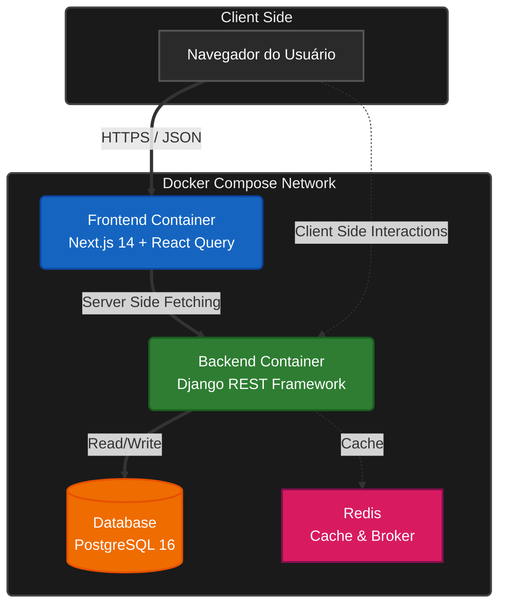
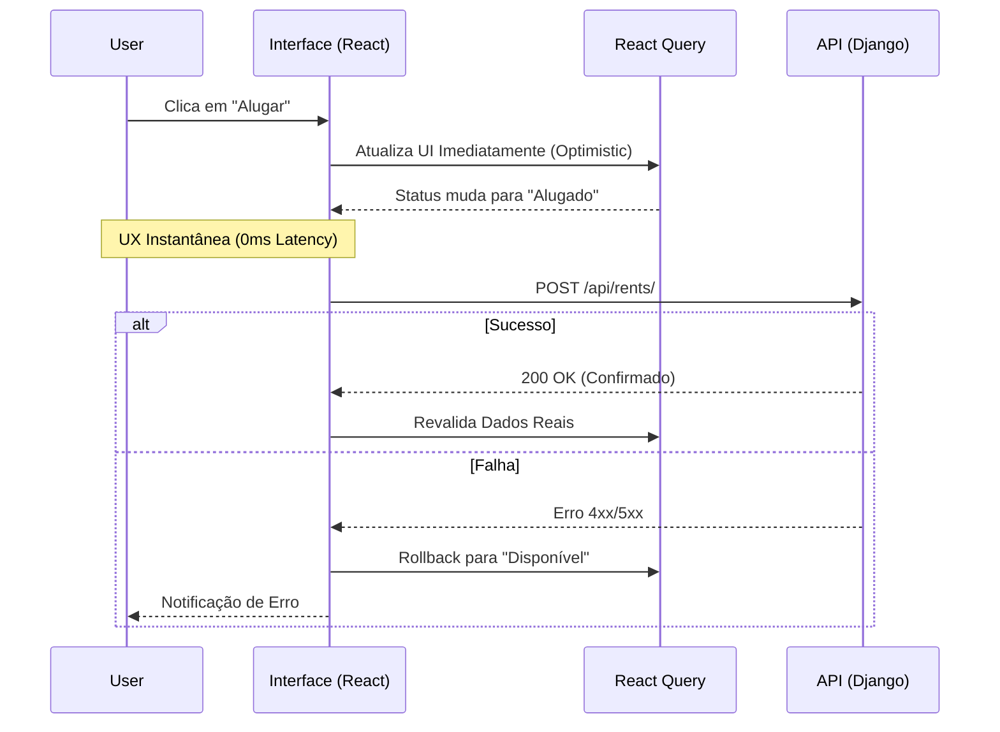

# 🚜 Sigma Loc10 | Enterprise Asset Management

> **High-Fidelity PoC:** Uma Prova de Conceito funcional demonstrando **Arquitetura Resiliente**, **Escalabilidade** e **Experiência do Usuário (UX)** em um ciclo curto de desenvolvimento.

<div align="center">

[](https://sigma-loc10.vercel.app/)
[](https://github.com/paulojoseph/sigma-loc10/releases)
[](https://sigma-loc10-production.up.railway.app/admin/)


</div>

---

## 📑 Índice
- [🚀 Acesso Rápido](#acesso-rapido)
- [🎯 Contexto & Produtividade](#contexto-produtividade)
- [💎 Filosofia de Engenharia](#filosofia-de-engenharia)
- [🏗️ Arquitetura do Sistema](#arquitetura-do-sistema)
- [🕹️ Roteiro de Teste](#roteiro-de-teste)
- [🛠️ Stack Tecnológico](#stack-tecnologico)
- [🚀 Instalação e Execução](#instalacao-e-execucao)
- [📚 Documentação Estendida](#documentacao-estendida)
- [🗺️ Roadmap Estratégico](#roadmap-estrategico-v20)

---

<a id="acesso-rapido"></a>
## 🚀 Acesso Rápido

### ⚠️ Credenciais de Demonstração
O sistema já vem populado com um superusuário para testes imediatos. **Não utilize em produção.**

- **Painel Admin:** [Acessar Backoffice](https://sigma-loc10-production.up.railway.app/admin/)
- **Usuário:** `admin`
- **Senha:** `admin123`

---

<a id="contexto-produtividade"></a>
## 🎯 Contexto & Produtividade

Este projeto é um *Proof of Concept (PoC)* de alta fidelidade desenvolvido em um ciclo curto de **48 horas corridas** (Sprint Solo).

O objetivo foi simular um cenário de alta pressão para demonstrar como a união de **Experiência de Mercado** com **Ferramentas de Produtividade** permite entregar software enterprise, com infraestrutura real e documentação técnica, em tempo recorde.

> ℹ️ **Nota sobre Engenharia de Software:**
>
> 1. **Git Flow vs. Trunk-Based:** Optei deliberadamente por comitar diretamente na `main` (*Trunk-Based Development*). Em um cenário de "War Room" solo, a prioridade foi maximizar a **velocidade de entrega**. Em um time distribuído, a prática padrão seria o uso de *Feature Branches* com *Code Review* (PRs).
> 2. **Histórico de Commits:** Optei por não utilizar *Squash* para manter a transparência absoluta da linha do tempo. O histórico reflete a realidade de um desenvolvimento acelerado e a **resolução dos desafios de infraestrutura** (Docker/Railway) em tempo real.

<a id="filosofia-de-engenharia"></a>
## 💎 Filosofia de Engenharia

Minha abordagem no desenvolvimento é guiada por dois pilares inegociáveis:

### 1. UX-Driven (Obsessão pela Experiência)
Software lento ou confuso é um desrespeito ao tempo do usuário.
* **Tolerância Zero à Latência:** Implementei **Optimistic UI** porque o usuário não deve esperar o servidor "pensar" para ver o resultado de sua ação.
* **Resiliência Visual:** O sistema deve parecer robusto. Tratamento de erros, *loading states* e feedbacks visuais não são "extras", são requisitos essenciais.

### 2. Risk-Driven (Engenharia Orientada a Risco)
Segurança e consistência de dados protegem a saúde do negócio.
* **🛡️ Integridade de Estoque:** Prevenção total de "Overbooking" através de transações atômicas (ACID) no Backend.
* **� Controle de Acesso Estrito:** Ações destrutivas (Deleção de Equipamentos) são restritas exclusivamente ao **Backoffice Administrativo**, prevenindo erros operacionais no Frontend.

---

<a id="arquitetura-do-sistema"></a>
## 🏗️ Arquitetura do Sistema

A solução foi orquestrada via Docker Compose para garantir paridade entre desenvolvimento e produção.



### UX na Prática (Optimistic UI)
O diagrama abaixo detalha o fluxo que implementei para eliminar a sensação de espera durante o aluguel:



<a id="roteiro-de-teste"></a>
## 🕹️ Roteiro de Teste (Sugestão para Recrutador)

Para validar o sistema de ponta a ponta, sugiro o seguinte fluxo:

### Visão do Usuário (Frontend):
1. Acesse a **Demonstração Online**.
2. Navegue pela frota. Observe que a interface é rápida (Server Side Rendering).
3. Tente alugar um equipamento disponível. O feedback é instantâneo.

### Visão do Administrador (Backoffice):
1. Acesse o **Painel Admin**.
2. Faça login com as credenciais acima.
3. Edite um equipamento (ex: mude o status para `MAINTENANCE` -> Em Manutenção).
    *   *Nota: A exclusão física de registros (Hard Delete) só pode ser feita aqui.*
4. Volte ao Frontend e dê F5 (ou aguarde a revalidação). O status terá mudado.

Isso valida a integração completa entre as partes do sistema.

<a id="stack-tecnologico"></a>
## 🛠️ Stack Tecnológico

### Frontend | Next.js 14 + React Query
A escolha do stack foi pragmática, focada em resolver dores reais de performance:
*   **TanStack Query (v5):** Elimina a necessidade de useEffect manuais e garante cache inteligente.
*   **Service Layer Desacoplada:** Isolamento total da lógica de API em `src/services`, garantindo tipos estritos (TypeScript).
*   **Design System:** TailwindCSS + Lucide Icons para interface limpa, acessível e consistente.

### Backend | Django REST Framework
Escolhido pela segurança padrão ("batteries-included") e velocidade de implementação:
*   **Arquitetura Modular:** Separação clara de contextos (core, accounts, equipment) facilitando futura extração para microsserviços.
*   **Django Admin:** Utilizado como Backoffice administrativo, economizando centenas de horas de desenvolvimento.
*   **Serializers:** Validação estrita de entrada (Sanitization) para garantir que nenhum dado sujo entre no banco.

<a id="instalacao-e-execucao"></a>
## 🚀 Instalação e Execução (Zero-Config)

O ambiente é 100% Dockerizado para execução.

### Pré-requisitos
*   Docker Desktop
*   Git
*   Node.js (Opcional, para melhor DX no VS Code)

### Passo 1: Preparar Ambiente (Recomendado)
Para garantir que o Intellisense do VS Code funcione corretamente (autocompletar e tipagem) e evitar erros visuais no editor, recomendamos instalar as dependências do frontend localmente:

```bash
cd apps/web
npm install
cd ../..
```

### Passo 2: Subir a Aplicação
Execute o comando abaixo na raiz do projeto. Ele irá configurar variáveis de ambiente, criar o banco, rodar migrações e popular o seed.

```bash
# Copie o env de exemplo
# Windows: copy .env.example .env
# Linux/Mac: cp .env.example .env
cp .env.example .env

# Sobe todo o ecossistema
docker compose up --build
```
Aguarde até ver a mensagem "Ready in Xms" no terminal.

### 🔗 Portas de Acesso
*   **Frontend:** `http://localhost:3000`
*   **Backoffice (Django Admin):** `http://localhost:8000/admin` (Login: `admin` / Senha: `admin123`)

### 🧪 Qualidade e CI/CD
Qualidade não é opcional. O projeto conta com pipeline no GitHub Actions validando cada commit:
*   **Frontend Check:** Linting (ESLint) e verificação de Build.
*   **Backend Check:** Testes de integração (Pytest) rodando contra banco PostgreSQL efêmero.

Para rodar localmente:
```bash
# Testes do Backend
docker compose exec api pytest

# Lint do Frontend
docker compose exec frontend npm run lint
```

<a id="documentacao-estendida"></a>
## 📚 Documentação Estendida (Deep Dive)

Para não poluir o README principal, detalhei as decisões de engenharia na pasta `.docs/`. Recomendo a leitura para entender a profundidade do projeto:

| Arquivo | Descrição |
| :--- | :--- |
| **00_contexto_produto.md** | 🧠 **Visão de Negócio:** O problema real que o software resolve e a filosofia Risk-Driven. |
| **01_stack_regras.md** | 👮 **Linter Humano:** Regras estritas de código, Anti-patterns proibidos e guia de estilo para IA. |
| **02_arquitetura.md** | 📐 **Diagramas:** Detalhamento do fluxo de dados, camadas de serviço e decisões de Clean Arch. |
| **03_matriz_risco.md** | 🛡️ **Análise de Risco:** Tabela completa de riscos de negócio (Overbooking, Latência) e suas mitigações técnicas. |

<a id="roadmap-estrategico-v20"></a>
## 🗺️ Roadmap Estratégico (V2.0)

Este roteiro demonstra como a plataforma evolui de um MVP para uma solução Enterprise escalável.

### 🔴 Prioridade ALTA (Confiabilidade & Segurança)
Foco em mitigar riscos críticos identificados na Matriz de Risco:
* [ ] **Locking Pessimista:** Implementação de `select_for_update` em transações de reserva para garantir integridade absoluta de estoque em alta concorrência.
* [ ] **Autenticação Robusta:** Migração para JWT com rotação de chaves e Refresh Tokens via Cookies HttpOnly.
* [ ] **Idempotência:** Adicionar keys únicas em requisições de POST para evitar duplicação de contratos em falhas de rede.

### 🟡 Evolução Técnica (Performance & Ops)
* [ ] **Observabilidade:** Instrumentação com OpenTelemetry e visualização no Grafana para rastrear gargalos de latência.
* [ ] **Cache Distribuído:** Reintrodução do Redis para cache de sessão e throttling de API.
* [ ] **Offline-Ready:** Sincronização em background para permitir que engenheiros de campo operem sem internet (PWA).

### � Expansão de Negócio
* [ ] **Gateway Financeiro:** Integração Stripe/Asaas para cobrança automatizada.
* [ ] **Auditoria Fiscal:** Logs imutáveis de todas as transações para compliance.

---
**Desenvolvido por Paulo Marques**