# 🚜 Sigma Loc10 | Enterprise Asset Management

> **Technical Showcase:** Aplicação Full Stack desenvolvida com foco em **Arquitetura Resiliente**, **Escalabilidade** e **Experiência do Usuário (UX)**.


<div align="center">

[](https://sigma-loc10.vercel.app/)
[](https://sigma-loc10-production.up.railway.app/admin/)


</div>

---

## 📑 Índice
- [🚀 Acesso Rápido](#acesso-rápido)
- [🎯 Contexto & Produtividade](#contexto--produtividade)
- [💎 Filosofia de Engenharia](#filosofia-de-engenharia)
- [🏗️ Arquitetura do Sistema](#arquitetura-do-sistema)
- [🕹️ Roteiro de Teste](#roteiro-de-teste-sugestão-para-recrutador)
- [🛠️ Stack Tecnológico](#stack-tecnológico)
- [🚀 Instalação e Execução](#instalação-e-execução-zero-config)
- [📚 Documentação Estendida](#documentação-estendida-deep-dive)
- [🗺️ Roadmap Estratégico](#roadmap-estratégico-v20)

---

## 🚀 Acesso Rápido

### ⚠️ Credenciais de Demonstração
O sistema já vem populado com um superusuário para testes imediatos. **Não utilize em produção.**

- **Painel Admin:** [Acessar Backoffice](https://sigma-loc10-production.up.railway.app/admin/)
- **Usuário:** `admin`
- **Senha:** `admin123`

---

## 🎯 Contexto & Produtividade

Este projeto é um *Proof of Concept (PoC)* desenvolvido em **menos de 24 horas corridas**.

O objetivo foi simular um cenário de pressão real para demonstrar como a união de **Experiência de Mercado** com **Fluxos de IA Modernos** permite entregar software enterprise, testado e documentado, em tempo recorde. Não é apenas sobre codificar rápido, mas sobre arquitetar corretamente desde o primeiro minuto.

## 💎 Filosofia de Engenharia

Minha abordagem no desenvolvimento é guiada por dois pilares inegociáveis:

### 1. UX-Driven (Obsessão pela Experiência)
Software lento ou confuso é um desrespeito ao tempo do usuário.
* **Tolerância Zero à Latência:** Implementei **Optimistic UI** porque o usuário não deve esperar o servidor "pensar" para ver o resultado de sua ação.
* **Resiliência Visual:** O sistema deve parecer robusto. Tratamento de erros, *loading states* e feedbacks visuais não são "extras", são requisitos essenciais.

### 2. Risk-Driven (Engenharia Orientada a Risco)
Segurança e consistência de dados protegem a saúde do negócio.
* **🛡️ Integridade de Estoque:** Prevenção total de "Overbooking" através de transações atômicas (ACID) no Backend.
* **📉 Dívida Técnica Controlada:** Adoção de **Service Pattern** no Frontend. A UI desconhece a lógica HTTP, facilitando refatorações futuras.

---

## 🏗️ Arquitetura do Sistema

A solução foi orquestrada via Docker Compose para garantir paridade entre desenvolvimento e produção.


### UX na Prática (Optimistic UI)
O diagrama abaixo detalha o fluxo que implementei para eliminar a sensação de espera durante o aluguel:

```mermaid
sequenceDiagram
    participant User
    participant UI as Interface (React)
    participant Cache as React Query
    participant API as API (Django)
    
    User->>UI: Clica em "Alugar"
    UI->>Cache: Atualiza UI Imediatamente (Optimistic)
    Cache-->>UI: Status muda para "Alugado"
    Note over User, UI: UX Instantânea (0ms Latency)
    
    UI->>API: POST /api/rents/
    
    alt Sucesso
        API-->>UI: 200 OK (Confirmado)
        UI->>Cache: Revalida Dados Reais
    else Falha
        API-->>UI: Erro 4xx/5xx
        UI->>Cache: Rollback para "Disponível"
        UI-->>User: Notificação de Erro
    end
```



---

## 🕹️ Roteiro de Teste (Sugestão para Recrutador)
Para validar o sistema de ponta a ponta, sugiro o seguinte fluxo:

1. **Visão do Usuário (Frontend):**
   - Acesse a [Demonstração Online](https://sigma-loc10.vercel.app/).
   - Navegue pela frota. Observe que a interface é rápida (Server Side Rendering).
   - Tente alugar um equipamento disponível. O feedback é instantâneo.

2. **Visão do Administrador (Backoffice):**
   - Acesse o [Painel Admin](https://sigma-loc10-production.up.railway.app/admin/).
   - Faça login com as credenciais acima.
   - Edite um equipamento (ex: mude o status para `MAINTENANCE` -> **Em Manutenção**).
   - Volte ao Frontend e dê F5 (ou aguarde a revalidação). O status terá mudado.

Isso valida a integração entre as partes do sistema.

---

## 🛠️ Stack Tecnológico

### Frontend | Next.js 14 + React Query
A escolha do stack foi pragmática, focada em resolver dores reais de performance:
- **TanStack Query (v5):** Elimina a necessidade de useEffect manuais e garante cache inteligente.
- **Service Layer Desacoplada:** Isolamento total da lógica de API em `src/services`, garantindo tipos estritos (TypeScript).
- **Design System:** TailwindCSS + Lucide Icons para interface limpa, acessível e consistente.

### Backend | Django REST Framework
Escolhido pela segurança padrão ("batteries-included") e velocidade de implementação:
- **Arquitetura Modular:** Separação clara de contextos (`core`, `accounts`, `equipment`) facilitando futura extração para microsserviços.
- **Django Admin:** Utilizado como Backoffice administrativo, economizando centenas de horas de desenvolvimento.
- **Serializers:** Validação estrita de entrada (Sanitization) para garantir que nenhum dado sujo entre no banco.

---

## 🚀 Instalação e Execução (Zero-Config)

O ambiente é 100% Dockerizado para garantir que o projeto rode na sua máquina exatamente como roda na minha.

### 📋 Pré-requisitos Obrigatórios
Para executar este projeto localmente, é mandatório ter instalado:
- [Docker Desktop (Windows/Mac/Linux)](https://www.docker.com/products/docker-desktop/) - Essencial para orquestrar os containers.
- Git

### 1. Clone e Suba (Zero-Touch)

```bash
git clone https://github.com/paulojoseph/sigma-loc10.git
cd sigma-loc10

# Configure o ambiente
# Windows: copy .env.example .env
# Mac/Linux: cp .env.example .env
cp .env.example .env

# Sobe todo o ecossistema
# O script de entrypoint fará automaticamente:
# 1. Aguardar o Banco
# 2. Rodar Migrations
# 3. Carregar dados de teste (Seed)
# 4. Criar superusuário (admin/admin123)
docker compose up --build
```

**Aguarde até ver a mensagem "Ready in Xms" no terminal.**

---

## 🔗 Portas de Acesso

- **Frontend:** http://localhost:3000
- **Backoffice (Django Admin):** http://localhost:8000/admin (Login: `admin` / Senha: `admin123`)

---

## 🧪 Qualidade e CI/CD

Qualidade não é opcional. O projeto conta com pipeline no GitHub Actions validando cada commit:
- **Frontend Check:** Linting (ESLint) e verificação de Build.
- **Backend Check:** Testes de integração (Pytest) rodando contra banco PostgreSQL efêmero.

Para rodar localmente:

```bash
# Testes do Backend
docker compose exec api pytest

# Lint do Frontend
docker compose exec frontend npm run lint
```

---

## 📚 Documentação Estendida (Deep Dive)

Para não poluir o README principal, detalhei as decisões de engenharia na pasta [.docs/](.docs/). Recomendo a leitura para entender a profundidade do projeto:

| Arquivo | Descrição |
|---------|-----------|
| [00_contexto_produto.md](.docs/00_contexto_produto.md) | 🧠 **Visão de Negócio:** O problema real que o software resolve e a filosofia Risk-Driven. |
| [01_stack_regras.md](.docs/01_stack_regras.md) | 👮 **Linter Humano:** Regras estritas de código, Anti-patterns proibidos e guia de estilo para IA. |
| [02_arquitetura.md](.docs/02_arquitetura.md) | 📐 **Diagramas:** Detalhamento do fluxo de dados, camadas de serviço e decisões de Clean Arch. |
| [03_matriz_risco.md](.docs/03_matriz_risco.md) | 🛡️ **Análise de Risco:** Tabela completa de riscos de negócio (Overbooking, Latência) e suas mitigações técnicas. |

---

## 🗺️ Roadmap Estratégico (V2.0)

Este roteiro demonstra como a plataforma evolui de um MVP para uma solução Enterprise escalável.

### � Prioridade ALTA (Confiabilidade & Segurança)
Foco em mitigar riscos críticos identificados na Matriz de Risco:
- [ ] **Locking Pessimista:** Implementação de `select_for_update` em transações de reserva para garantir integridade absoluta de estoque em alta concorrência.
- [ ] **Autenticação Robusta:** Migração para JWT com rotação de chaves e Refresh Tokens via Cookies HttpOnly.
- [ ] **Idempotência:** Adicionar keys únicas em requisições de POST para evitar duplicação de contratos em falhas de rede.

### ⚡ Evolução Técnica (Performance & Ops)
- [ ] **Observabilidade:** Instrumentação com OpenTelemetry e visualização no Grafana para rastrear gargalos de latência.
- [ ] **Cache Distribuído:** Reintrodução do Redis para cache de sessão e *throttling* de API.
- [ ] **Offline-Ready:** Sincronização em background para permitir que engenheiros de campo operem sem internet (PWA).

### 💼 Expansão de Negócio
- [ ] **Gateway Financeiro:** Integração Stripe/Asaas para cobrança automatizada.
- [ ] **Auditoria Fiscal:** Logs imutáveis de todas as transações para compliance.

---

---
*Desenvolvido por Paulo Marques*