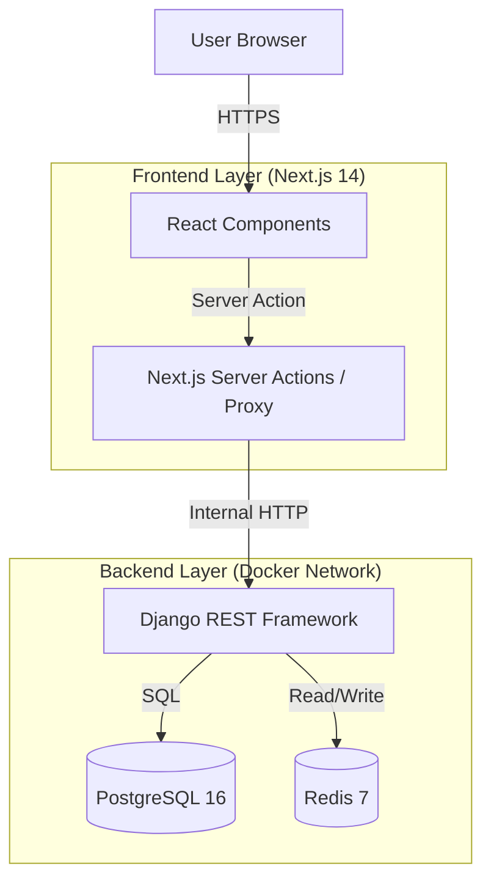

# Architecture: Loc10 (Technical Showcase)

## 1. High-Level Data Flow

## 2. Component Design

### 2.1 Backend (Django 5)
- **Role**: Source of Truth, Business Logic, Persistence.
- **Pattern**: Service Layer. Views should only handle HTTP req/res; Logic lives in `services.py`.
- **Security**: 
    - No direct access to DB from outside Docker network.
    - JWT Authentication (HttpOnly cookies handled by BFF/Next.js or direct API depending on flow - *Decision: Direct API for simplicity in showcase, HttpOnly cookie set by Backend*).

### 2.2 Frontend (Next.js 14 App Router)
- **Role**: Presentation, Validation, BFF (Backend for Frontend).
- **Pattern**: Server Components (RSC) by default. Client Components only for interactivity.
- **State**: Zustand for global client state (e.g., Cart/Booking draft).

## 3. Why this Architecture?

### Why Separation? (Next.js + Django)
While Django Templates are mature, the market demands **React**. Separation allows:
1.  **Specialization**: Frontend Engineers work in `apps/web`, Backend in `apps/api`.
2.  **Scalability**: We can deploy the Node.js frontend to Vercel/Edge and the Python Container to AWS ECS/K8s independently.

### Why Docker?
To mitigate the risk of **MTN-01 ("It works on my machine")**. The entire ecosystem (DB, Redis, API) boots with one command: `docker compose up`.

### Why PostgreSQL?
We need **ACID compliance** for Rentals (financial transactions). NoSQL is unsuitable for the relational complexity of Inventory management.
